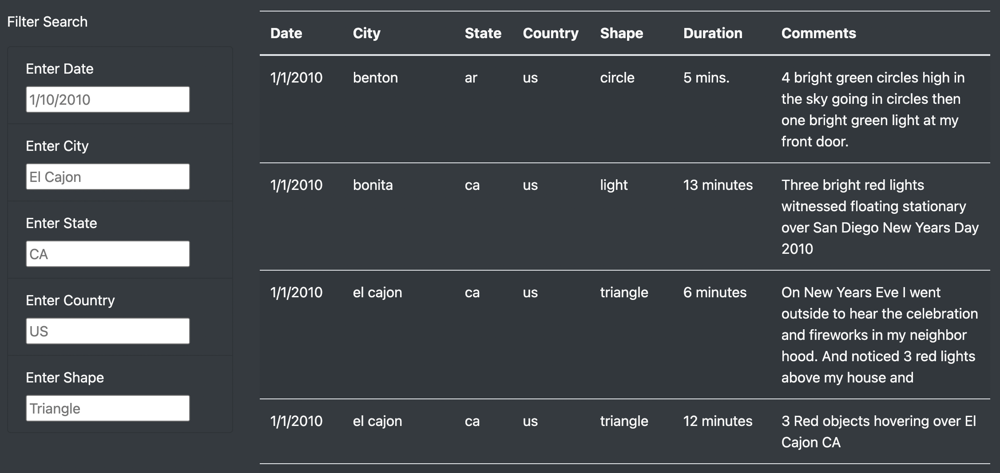
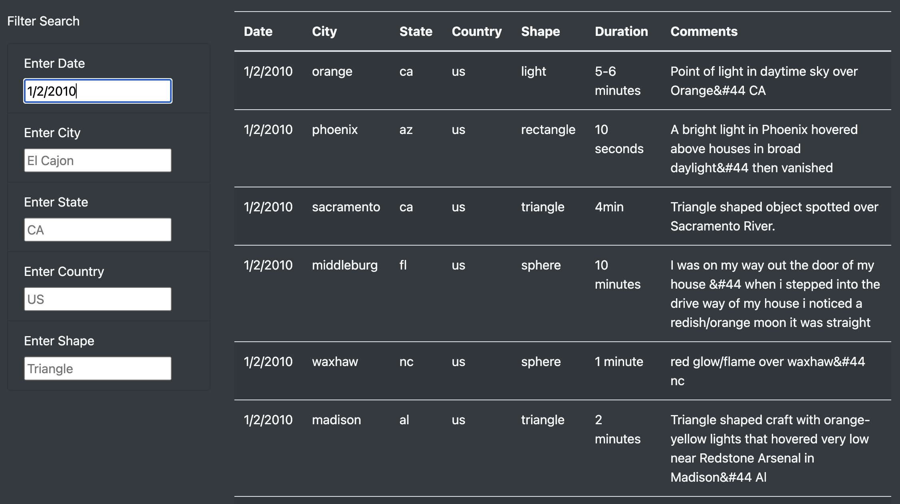
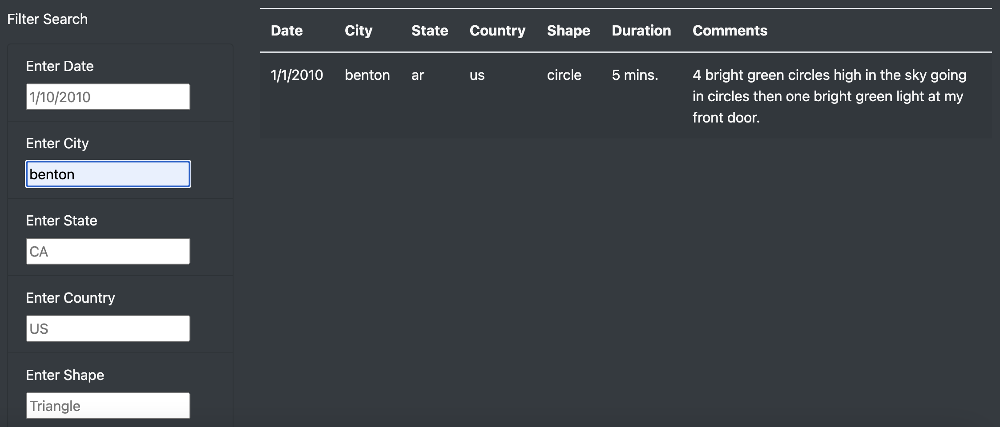
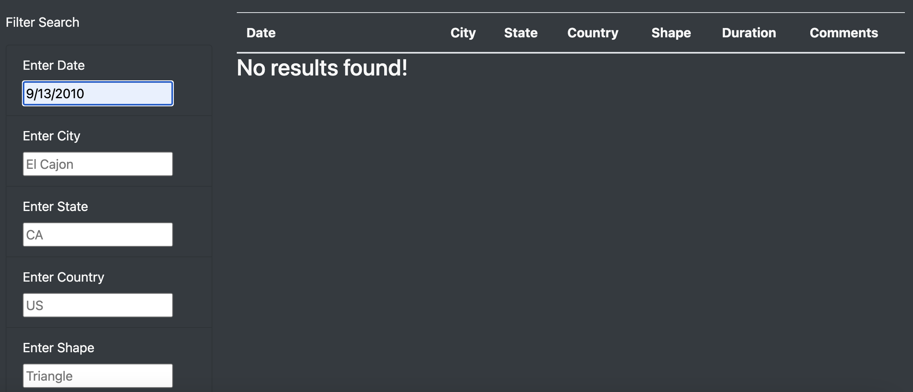
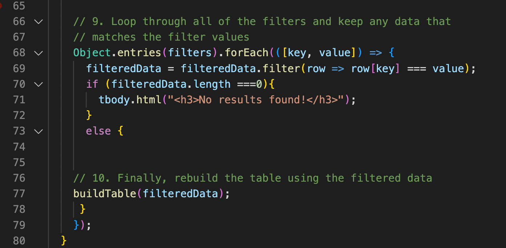

# UFOs

[Link to Webpage](https://bishopce16.github.io/UFOs/)

## Overview of Project 
The purpose of this project was to build a dynamic webpage and to take data from a JavaScript array to create an organized a table to filter UFO sighting data on multiple criteria. The table was built with JavaScript functions to loop through the data and create a customized dashboard. Html, CSS, and Bootstrap was used to modify the aesthetics of the webpage.  

---

## Resource: 

Data Sources: data.js 

Tool used: Visual Studio Code, HTML, JavaScript, Bootstrap, CSS 

---

## Results: 

Welcome/First encounter of the webpage: 
The Truth Is Out There webpage presents visitors with a dark background and light font with an image displayed using the style.css file. 

 

---

Filter Search: 
Below is the default table that is displayed when the webpage opens.

 

The UFO sightings data was filtered on multiple criteria, including city, state, country, and shape.  This was accomplished by using JavaScript functions to loop through the data. The filters include event listeners that record information when an element is changed to develop an interactive webpage based on user’s input.

 
The search criteria displaying results for date "1/2/2010" above and city "benton" below.

 

  
---

## Summary: 

An if statement was added to the app.js file on line 70 to display “No results found” for a search that does not exist, instead of a default filled table. 

 

---

Addresses one drawback of this webpage: 
* The search field is case sensitive and requires lower case and correct spelling. 
* The data is also limited as it is not liked to a live source. 

---

Recommendations for further development: 
* Adding a scraping functionality to pull data from a live source that includes archived and current data. 
* Add further customizations for example a dropdown list, auto fill, or click button to make the webpage more user friendly and to remove the case sensitivity. 

---
